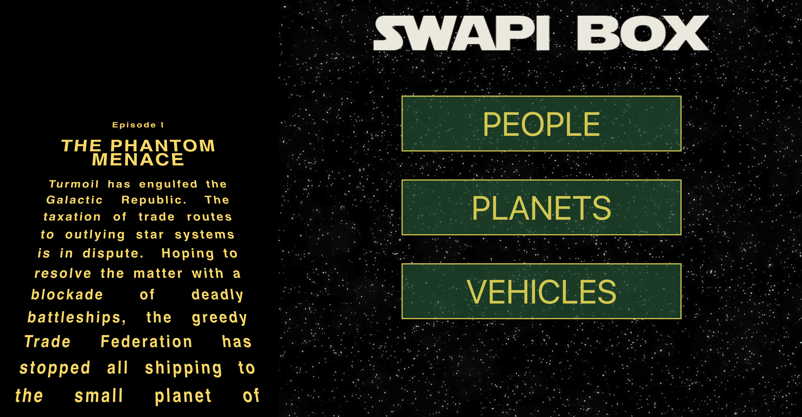
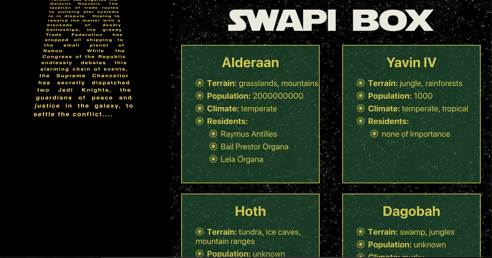

# SWAPI-Box
Ad educational project utilizing the Star Wars API to display various information using asynchronous JavaScript and a card UI.

## Installation
Clone the repo - https://github.com/jacobogart/SWAPI-Box.git

Run `npm install` from the root directory

Run `npm start` and visit localhost:8080 in your browser

## Testing
Website is tested with Jest and Enzyme

Run `npm run test` to see test suite

## Learning Goals
* Utilize asynchronous JavaScript with data requiring multiple fetch calls
* Populating the DOM with data from an external server
* Use async/await syntax to test asynchronous fetch calls 
